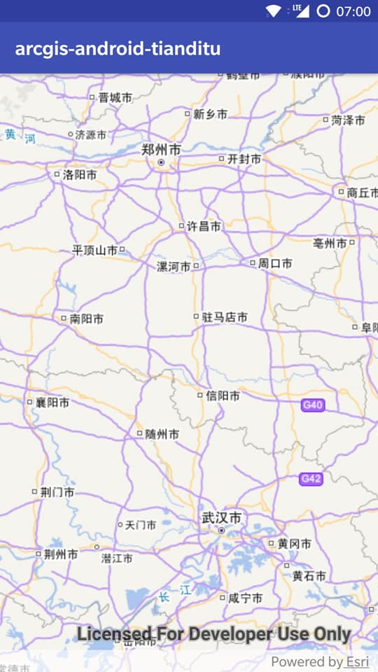
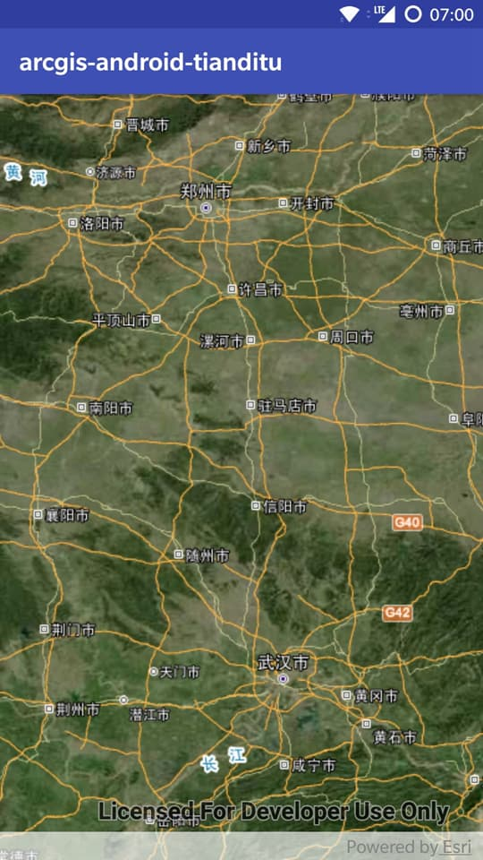
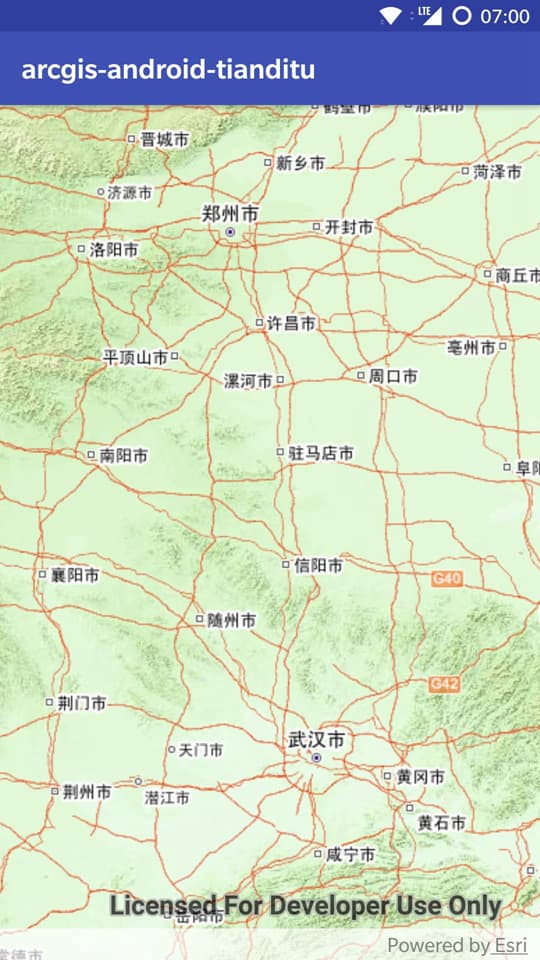

# arcgis-android-tianditu

[](https://bintray.com/wshunli/maven/arcgis-android-tianditu/_latestVersion)
[](https://travis-ci.org/wshunli/arcgis-android-tianditu)
[](http://www.wshunli.com)
[](https://github.com/wshunli/arcgis-android-tianditu/blob/master/LICENSE)

基于 ArcGIS for Android 的天地图图层显示及缓存

 |  | 
:-: | :-: | :-:
矢量 | 影像 | 地形

## 天地图授权

天地图于 2019年1月1日 停止对无开发许可（Key）使用应用程序开发接口或者调用在线服务的支持。

http://lbs.tianditu.gov.cn/authorization/authorization.html

请参考以上内容申请 token 值，以继续使用本依赖。

## 依赖

### ArcGIS for Android 依赖

在使用 arcgis-android-tianditu 之前需要添加 ArcGIS 仓库 以及 ArcGIS for Android 依赖。

```groovy
repositories {
    jcenter()
    // Add the Esri public Bintray Maven repository
    maven {
        url 'https://esri.bintray.com/arcgis'
    }
}
dependencies {
    // Add ArcGIS Runtime SDK for Android dependency
    implementation 'com.esri.arcgisruntime:arcgis-android:100.3.0'
}
```

更多信息可参考: [ArcGIS for Android开发环境搭建](http://www.wshunli.com/posts/29ec97b7.html)

### arcgis-android-tianditu 依赖

arcgis-android-tianditu 已经发布至 jcenter ，确定项目已配置 jcenter 仓库即可。

```groovy
// 添加 arcgis-android-tianditu 依赖
dependencies {
    implementation 'com.wshunli.map:arcgis-android-tianditu:2.2.1'
}
```

**强烈建议使用最新版**，查看更多版本： [arcgis-android-tianditu releases](https://github.com/wshunli/arcgis-android-tianditu/releases)

## 快速开始

### 声明权限

除 ArcGIS for Android 三个权限外，arcgis-android-tianditu 不需要额外权限:

``` XML
<uses-feature android:glEsVersion="0x00020000" android:required="true" />

<uses-permission android:name="android.permission.INTERNET" />
<uses-permission android:name="android.permission.WRITE_EXTERNAL_STORAGE" />
<uses-permission android:name="android.permission.ACCESS_FINE_LOCATION" />
```

针对 Android 6.0+ 以上版本, 注意运行时权限请求。

### 初始化

``` Java
// 初始化
TianDiTuLayer.getInstance().init(this, "TDT_KEY");
```

建议在 Application 实现类中初始化，比如：

``` Java
public class App extends Application {
    @Override
    public void onCreate() {
        super.onCreate();
        // 简单初始化
        TianDiTuLayer.getInstance().init(this, "TDT_KEY");
    }
}
```

### 简单示例

``` Java
MapView mMapView = findViewById(R.id.mapView);
WebTiledLayer webTiledLayer = TianDiTuLayer.getInstance().getLayer(
        TianDiTuLayerType.VECTOR,
        TianDiTuLayerType.SR.ID_2000
);
Basemap basemap = new Basemap(webTiledLayer);
mMapView.setMap(new ArcGISMap(basemap));
```

### 缓存切片

暂不支持

## 支持图层类型

支持切片图层：

切片类型 | 对应字段 | 
:-: | :-: 
矢量切片图层 | TianDiTuLayerType.VECTOR 
影像切片图层 | TianDiTuLayerType.IMAGE 
地形切片图层 | TianDiTuLayerType.TERRAIN 

支持标注图层：

切片类型 | 对应中文标注 | 对应英文标注 | 
:-: | :-: | :-: 
矢量切片图层 | TianDiTuLayerType.VECTOR_ANNOTATION_CN | TianDiTuLayerType.VECTOR_ANNOTATION_CN
影像切片图层 | TianDiTuLayerType.IMAGE_ANNOTATION_CN | TianDiTuLayerType.IMAGER_ANNOTATION_CN
地形切片图层 | TianDiTuLayerType.TERRAIN_ANNOTATION_CN | 暂不支持

支持坐标系：

坐标系类型 | 对应字段 | 
:-: | :-: 
国家 2000 坐标系 | TianDiTuLayerType.SR.ID_2000
墨卡托投影 | TianDiTuLayerType.SR.ID_1021000


更多信息可以查看 [示例](https://github.com/wshunli/arcgis-android-tianditu/tree/master/sample)

## 10.X 版本

（不推荐）针对 ArcGIS for Android 10.2.9 及以前的版本，请参考 [README.10.X](README.10.X.md) 


## License

    Copyright 2017 wshunli

    Licensed under the Apache License, Version 2.0 (the "License");
    you may not use this file except in compliance with the License.
    You may obtain a copy of the License at

       http://www.apache.org/licenses/LICENSE-2.0

    Unless required by applicable law or agreed to in writing, software
    distributed under the License is distributed on an "AS IS" BASIS,
    WITHOUT WARRANTIES OR CONDITIONS OF ANY KIND, either express or implied.
    See the License for the specific language governing permissions and
    limitations under the License.
